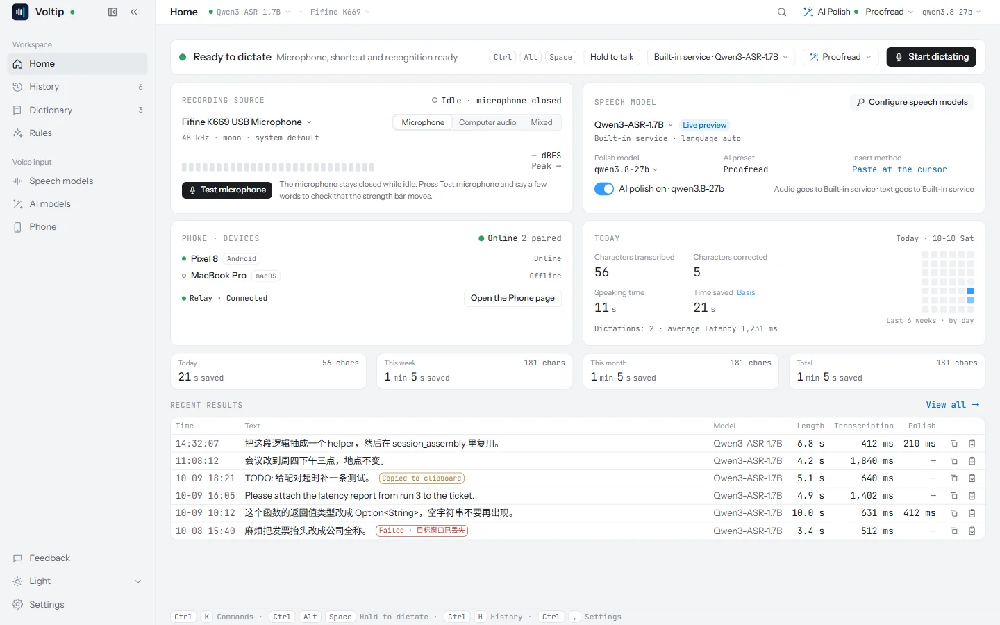

<div align="center">


# Voltip

### Hold a hotkey, speak, let go: the text lands at your cursor.

[](https://github.com/sunerpy/voltip/actions/workflows/ci.yml)
[](https://github.com/sunerpy/voltip/releases)
[](https://codecov.io/gh/sunerpy/voltip)
[](./LICENSE)

[Website](https://voltip.firlab.app) · [Video](#video) · [Features](#features) · [Install](#install) · [Quick start](#quick-start) · [Privacy](#privacy) · [Build from source](#build-from-source) · [Documentation](#documentation) · [Community](#community)

[**English**](./README.md) · [简体中文](./docs/readme/README.zh-CN.md)

</div>

---

Voltip is a dictation app for Windows, Linux and macOS. It records while you hold the hotkey,
recognises the speech in the cloud or on your own machine, optionally cleans the text up with an
LLM, and pastes it into whatever app has the focus. The Android app works on its own, or as the
computer's microphone and keyboard.



## Video

Voltip in 2 minutes 52 seconds: installing it, the first dictation, AI polish, voice edit,
recognition on this computer, the dictionary and the history. Recorded with 0.0.14; the
[Chinese version](./docs/readme/README.zh-CN.md#视频) is in the Chinese README.

https://github.com/user-attachments/assets/64e1fdc2-1ab0-42a6-a8c9-740a1efa2ecb

## Features

- Push-to-talk on a global hotkey (`Ctrl+Alt+Space` by default) or on a single key such as Right
  Ctrl or a mouse side button: hold to talk, press to start and press again to stop, or tap to lock
  a long take. A floating pill shows the input strength, the live transcript and the result.
- Recognition from a cloud provider (OpenAI, Groq, SiliconFlow, Alibaba Cloud Model Studio with its
  realtime models, or any OpenAI-compatible endpoint) or on-device: Qwen3-ASR 0.6B / 1.7B through
  transcribe.cpp, SenseVoice and Paraformer through sherpa-onnx. Qwen3-ASR runs on the GPU when
  there is one (Vulkan on Windows and Linux, measured on NVIDIA cards; Metal on macOS) and on the
  CPU otherwise.
- Live preview while you speak (a streaming Zipformer model), and output as one block, sentence by
  sentence, or from the stream directly.
- Clean-up by an LLM (the same providers, plus DeepSeek and a local Ollama), a personal dictionary
  that fixes words the recogniser keeps getting wrong, literal and regex replacement rules, and
  Simplified / Traditional Chinese normalisation.
- Voice edit: select text, hold `Ctrl+Alt+E`, say "make it more formal" or "translate to English",
  and the rewrite replaces the selection.
- Scenes: the app in focus when you start picks the polish style, output mode, language and extra
  instructions for that take.
- Long recordings: record the microphone, the sound your computer plays, or both mixed, for up to
  two hours in one take. A take is transcribed in segments while you speak, so the text is ready
  soon after you stop. In the history, an AI preset processes a long text in parts (Chinese ⇄
  English gives a translation, Key points a summary), and a take exports as SRT subtitles or as
  plain text.
- Phone as microphone and keyboard: pair an Android phone by QR code or a 6-digit code. Hold to
  talk on the phone (the audio goes end-to-end encrypted, compressed with Opus), or type or send
  the clipboard, and the text appears at the computer's cursor. The computer can keep pairing open
  for the next phone.
- The phone on its own: with no computer online, the phone recognises and cleans up the speech
  itself and copies the text. It has its own speech and AI providers, presets, dictionary, rules,
  scenes and history: every feature but the local models. A paired computer's history and
  settings sync to the phone to read, and what the phone recognised on its own goes to the
  computer as a copy.

## Install

### One line

Windows 10/11, in PowerShell:

```powershell
irm https://raw.githubusercontent.com/sunerpy/voltip/main/scripts/install.ps1 | iex
```

Linux (x86_64) and macOS (Apple silicon or Intel), in a terminal:

```bash
curl -fsSL https://raw.githubusercontent.com/sunerpy/voltip/main/scripts/install.sh | sh
```

The scripts pick the package for the computer, download it with the release's `SHA256SUMS`, and
install nothing unless the checksum matches:

- Windows: the per-user installer, run silently (no administrator prompt); Voltip starts when it
  is done.
- Linux: the `.deb` through `apt` where apt is (it asks for your password), otherwise the AppImage
  in `~/.local/bin` with an entry in the applications menu.
- macOS: the dmg for the Mac's processor, detected automatically (also from a Rosetta terminal);
  the app goes to `/Applications`, or `~/Applications` when that is not writable. Installed this
  way it opens without the Gatekeeper prompt.

Options go to `sh`, after the pipe: `curl -fsSL … | VOLTIP_VERSION=0.0.4 sh` installs a given
release instead of the latest, `VOLTIP_PACKAGE=appimage` takes the AppImage on a Debian-based
system, and `VOLTIP_INSTALL_DIR` moves the AppImage or the Mac app. In PowerShell, run
`$env:VOLTIP_VERSION = "0.0.4"` first. The commands read the scripts from `main`; to run the copy
a release shipped with, put its tag (for example `v0.0.4`) in place of `main`.

### Packages

Every [release](https://github.com/sunerpy/voltip/releases) carries the packages, `SHA256SUMS` and
build attestations:

| Platform | Package | Notes |
|---|---|---|
| Windows 10/11 x64 | `*_x64-setup.exe` (per-user installer), `*_x64-portable.zip` (unpack and run `voltip-desktop.exe`; keep the DLLs beside it) | Not code-signed yet: SmartScreen warns on the first start. |
| Linux x64 | `.deb`, `.AppImage` | Built on Ubuntu 22.04, needs glibc 2.34 or newer; the `.deb` depends on `libwebkit2gtk-4.1-0`, `libvulkan1` and a BLAS (`libblas3`, from 0.0.5), the AppImage needs FUSE 2 (`libfuse2`). X11 and Wayland. |
| Linux x64 server | `voltip-server-*-linux-x64.tar.gz` | The local speech service for a server without a desktop (below); `install.sh --server` installs it without root. |
| macOS 11+ (Apple silicon) | .dmg | M1 or newer |
| macOS 11+ (Intel) | .dmg | Intel Macs |
| Android 8.0+ (64-bit Arm) | `Voltip_*_android_arm64.apk` | Open it on the phone to install. The `.aab` is the package for Google Play. From 0.0.50 the app's screens use Android's own controls; it installs over 0.0.49 and earlier and keeps the pairing, settings and history. |

The Mac packages are `*_aarch64.dmg` (Apple silicon) and `*_x64.dmg` (Intel), signed with the
project's own self-signed certificate and not notarized. On a Mac, open the dmg and drag Voltip onto
Applications. The first start is blocked because the app is not notarized: on macOS 15 and later
open System Settings → Privacy & Security and click Open Anyway; on macOS 11 to 14 Control-click
Voltip in Applications and choose Open. From a terminal,
`xattr -dr com.apple.quarantine /Applications/Voltip.app` does the same. Updates install from inside
the app and keep the microphone and Accessibility permissions. The post-install keychain hand-over
in 0.0.15 and 0.0.16 did not work; 0.0.16 therefore asks once per keychain item when it installs the
first release with the pre-install fix. In-app updates between two fixed releases do not ask. Turn
Voltip off and on again under Accessibility and Microphone if dictation does not work.

Release packages come with a default recognition and clean-up service, so dictation works before
you configure anything. You can switch to another provider or to an on-device model at any time.

To check a download yourself, compare it with its line in `SHA256SUMS` (`sha256sum`, or
`shasum -a 256` on a Mac) and verify where it was built:

```bash
gh attestation verify Voltip_0.0.4_amd64.deb --repo sunerpy/voltip \
  --signer-workflow sunerpy/voltip/.github/workflows/release-candidate.yml
```

## Quick start

1. Start Voltip. It opens on the home page, ready to dictate with the default service. A missing
   permission (the microphone, and Accessibility on macOS) shows there with a button to grant it;
   Settings → General → Setup guide walks through the hotkey, the engine and a test take.
2. Put the cursor in any text field, hold `Ctrl+Alt+Space`, speak, let go.
3. On a pure Wayland session there is no global hotkey. Bind a compositor shortcut to
   `voltip-desktop --toggle` (and `--edit-toggle` for voice edit).

<p align="center">
  
</p>

For on-device recognition, open Speech models in the sidebar, choose This device and download a
model: Qwen3-ASR 0.6B (690 MB) is the recommended one, SenseVoice-small (240 MB) the lightest.
After that no audio leaves the machine.

The binary also has a headless command line, handy for scripts and servers:

```bash
voltip-desktop --list-models                      # the model library and what is installed
voltip-desktop --download-model qwen3-asr-0.6b    # resumable, sha256-verified
voltip-desktop --transcribe-file sample.wav --json
voltip-desktop --list-compute                     # CPU threads and the GPUs this build can use
```

Other programs on the computer, such as Paseo's dictation from a phone, can use Voltip's
recognition, dictionary and presets through an OpenAI-compatible `/v1/audio/transcriptions`:
switch on Settings → Local service in the app, or run `voltip-server` on a Linux server without a
desktop (`curl -fsSL https://raw.githubusercontent.com/sunerpy/voltip/main/scripts/install.sh | sh -s -- --server`).
It listens on this computer only and every request carries a token; see
[Local service](https://voltip.firlab.app/recognition/service).

## Privacy

Audio goes only to the recognition service you chose, or nowhere when you use an on-device model;
the engine pane and the home screen say which. Provider keys live in the operating system's
keychain (Windows Credential Manager, macOS Keychain, Secret Service on Linux) and are never shown
again after you save them. History stays on the computer and can be limited or turned off.

The phone and the computer pair with a Noise XX handshake and a safety code you compare on both
screens. They connect through a relay, which forwards their traffic end-to-end encrypted, so the
relay never sees audio or text; after a network drop they reconnect on their own.
[docs/threat-model.md](./docs/threat-model.md) lists what this protects against.

## Build from source

You need Rust (the version pinned in `rust-toolchain.toml`), Node 22 with pnpm 9, `cmake`, and on
Linux the Tauri system packages (`libwebkit2gtk-4.1-dev`, `libgtk-3-dev`, `libasound2-dev`, the
full list is in `.github/workflows/ci.yml`).

```bash
pnpm install --frozen-lockfile
make desktop-dev      # run the desktop app with hot reload
make verify           # every check CI runs: formatting, lint, tests, coverage, licences
make help             # everything else

# Packages. Without a default service baked in (see below) the scripts stop unless told so:
VOLTIP_ALLOW_NO_BUILTIN_ENGINES=1 make linux-x64     # .deb, .rpm and .AppImage in dist/linux-x64
VOLTIP_ALLOW_NO_BUILTIN_ENGINES=1 make windows-x64   # installer and portable zip, cross-built from Linux
```

Both package scripts build the Vulkan backend. They download the pinned Vulkan SDK (and, for
Windows, the Khronos loader `vulkan-1.dll`) into `~/.cache/voltip-vulkan` and check their SHA-256.

A build from source has no default service: pick a provider or an on-device model in the app. To
bake your own defaults in, copy `.env.build.example` to `.env.build` and fill it in; the build
scripts read it, and `.github/README-secrets.md` explains each value.

Every package carries `THIRD-PARTY-NOTICES.txt`: the licences of the Rust crates, the web frontend
packages, the fonts and the native libraries (sherpa-onnx, ONNX Runtime, transcribe.cpp / ggml, the
Vulkan loader) it includes. `scripts/release/third-party-notices.py` writes it; the package scripts
need `cargo-about` for that (`cargo install cargo-about --locked --features cli`).

## Documentation

The user guide is at [voltip.firlab.app](https://voltip.firlab.app), in English and
[Chinese](https://voltip.firlab.app/zh/); its pages live in [docs/site](./docs/site/README.md).

The design documents are in Chinese:

- [docs/architecture.md](./docs/architecture.md): the Rust core, the two Tauri shells and how they talk.
- [docs/dictation.md](./docs/dictation.md): the dictation pipeline, engines, models, hotkeys and injection.
- [docs/pairing.md](./docs/pairing.md), [docs/protocol.md](./docs/protocol.md) and [docs/threat-model.md](./docs/threat-model.md): pairing and the encrypted channel.
- [docs/frontend.md](./docs/frontend.md): the UI and its IPC contract.
- [docs/runbook.md](./docs/runbook.md): building, packaging, the relay and releases.
- [docs/feedback.md](./docs/feedback.md): what the in-app feedback sends, and the endpoint behind it.
- [docs/acceptance.md](./docs/acceptance.md): every feature mapped to its code and tests.

## Community

- Telegram: [the Voltip group](https://t.me/+gUetkPz35KgwNDg1)
- WeChat: the Voltip group and the Official Account 六月水蓝. The group's code is valid for seven
  days and is replaced every week; if WeChat reports that it has expired, follow the Official
  Account or join the Telegram group.

| Telegram group | WeChat group | Official Account 六月水蓝 |
| :---: | :---: | :---: |
|  |  |  |

Report a problem or suggest a feature in [GitHub issues](https://github.com/sunerpy/voltip/issues),
or with Feedback at the bottom of the app's sidebar.

## Contributing

Issues and pull requests are welcome. [AGENTS.md](./AGENTS.md) has the layout and the rules the
code follows, [CONTRIBUTING.md](./CONTRIBUTING.md) the workflow; report security problems as
described in [SECURITY.md](./SECURITY.md).

## License

[GNU Affero General Public License v3.0 or later](./LICENSE) (AGPL-3.0-or-later). Versions 0.0.20
and earlier were released under the Apache License 2.0 and stay under it.
