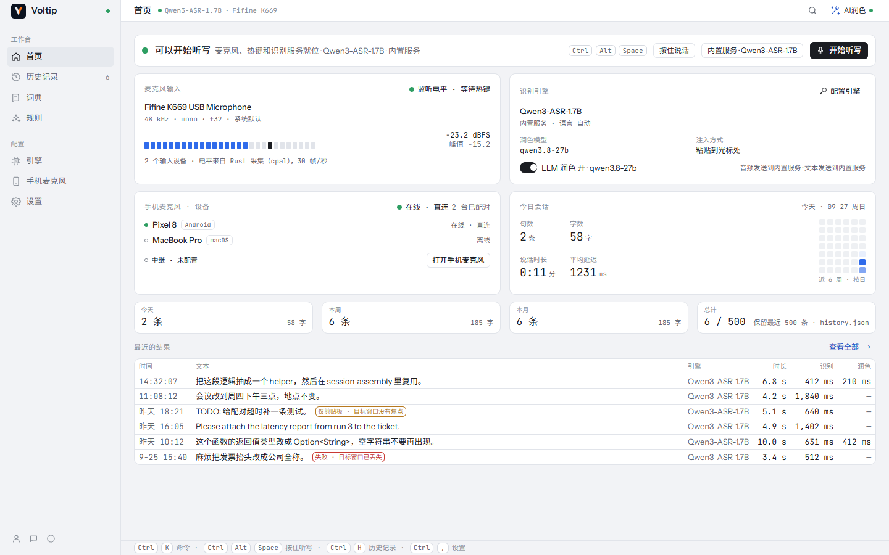
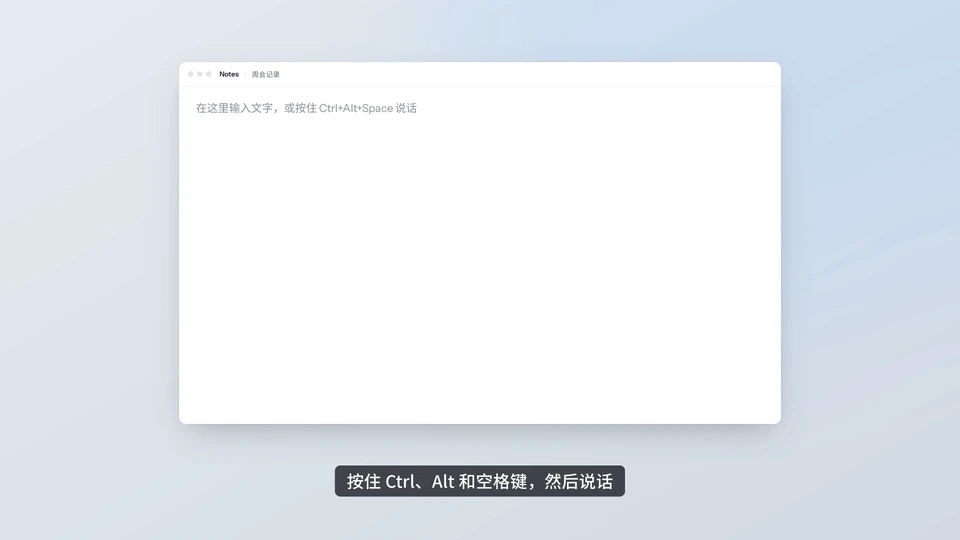

<div align="center">


# Voltip

### 按住热键说话，松开后文字落在光标处。

[](https://github.com/sunerpy/voltip/actions/workflows/ci.yml)
[](https://github.com/sunerpy/voltip/releases)
[](https://codecov.io/gh/sunerpy/voltip)
[](../../LICENSE)

[网站](https://voltip.firlab.app/zh/) · [视频](#视频) · [功能](#功能) · [安装](#安装) · [快速开始](#快速开始) · [隐私](#隐私) · [从源码构建](#从源码构建) · [文档](#文档) · [交流与反馈](#交流与反馈)

[English](../../README.md) · [**简体中文**](./README.zh-CN.md)

</div>

---

Voltip 是 Windows、Linux 和 macOS 上的语音输入工具。按住热键时录音，松开后交给云端或本机模型识别，可选用 LLM 润色，再粘贴到当前有焦点的应用里。Android 应用可以单独使用，也可以当电脑的麦克风和键盘。



## 视频

2 分 38 秒的使用教程：安装、第一次听写、AI 润色、语音编辑、本地识别、词典与规则，以及历史记录。使用 0.0.14 录制；[英文版](../../README.md#video)见英文 README。

https://github.com/user-attachments/assets/f1a0fcf0-e5f0-4c21-b487-f91299a59ce9

## 功能

- 全局热键按住说话（默认 `Ctrl+Alt+Space`），也可以只用一个键，比如右 Ctrl 或鼠标侧键：按住说、松开出字；也可以按一下开始、再按一下结束，或者轻点一下锁定，适合长段口述。录音时屏幕上的悬浮胶囊显示输入强度、实时文字和结果。
- 识别可以走云端服务商（OpenAI、Groq、硅基流动、阿里云百炼（含边说边识别的实时模型），或任意 OpenAI 兼容接口），也可以在本机跑：Qwen3-ASR 0.6B / 1.7B（transcribe.cpp），SenseVoice、Paraformer（sherpa-onnx）。Qwen3-ASR 有 GPU 时在 GPU 上跑（Windows 和 Linux 用 Vulkan，在 NVIDIA 显卡上实测过；macOS 用 Metal），没有 GPU 时用 CPU。
- 边说边出字的实时预览（流式 Zipformer 模型）；输出方式可以是整段输出、流式定稿或逐句实时插入。
- 可选的 LLM 润色（同样这些服务商，外加 DeepSeek 和本机的 Ollama）；个人词典专门纠正识别器总听错的词；字面和正则两种替换规则；中文统一成简体或繁体。
- 语音编辑：选中一段文字，按住 `Ctrl+Alt+E` 说「改得正式一点」或「翻译成英文」，改写结果直接替换选区。
- 场景：开始录音时哪个应用在前台，就按它决定这一次的润色风格、输出方式、语言和给 AI 的补充要求。
- 长录音：可以录麦克风、电脑播放的声音，或两者混合，单次最长 2 小时。录音时就分段识别，停止后很快出全文。在历史记录里可以用 AI 预设分段处理长文（「中英互译」得到译文，「要点纪要」得到要点），也可以导出 SRT 字幕素材或纯文本。
- 手机当麦克风和键盘：Android 手机扫二维码、输入 6 位码，或在同一局域网里直接点选找到的电脑完成配对。之后在手机上按住说话（音频经端到端加密、用 Opus 压缩传输），或输入文字、发送剪贴板，文字出现在电脑的光标处。电脑可以一直开着配对，等下一部手机。
- 手机单独使用：没有电脑在线时，手机自己识别、润色，并把文字复制到剪贴板。手机有自己的语音和 AI 服务商、预设、词典、规则、场景和历史记录，除本地模型外功能齐全。已配对电脑的历史记录和设置会同步到手机供查看，手机单独识别的记录会把副本上传到电脑。

## 安装

### 一行命令安装

Windows 10/11，在 PowerShell 里执行：

```powershell
irm https://raw.githubusercontent.com/sunerpy/voltip/main/scripts/install.ps1 | iex
```

Linux（x86_64）和 macOS（Apple 芯片或 Intel 芯片），在终端里执行：

```bash
curl -fsSL https://raw.githubusercontent.com/sunerpy/voltip/main/scripts/install.sh | sh
```

脚本会挑出适合这台电脑的安装包，连同 release 里的 `SHA256SUMS` 一起下载，校验不通过就什么都不装：

- Windows：静默运行按用户安装的安装器（不弹管理员授权），装完自动启动 Voltip。
- Linux：有 apt 的系统用 `apt` 装 `.deb`（会请你输入密码），否则把 AppImage 放到 `~/.local/bin`，并加进应用菜单。
- macOS：自动识别芯片（在 Rosetta 终端里也一样），下载对应的 dmg，把应用放进「应用程序」（没有写权限时放进 `~/Applications`）。这样装的应用打开时不会被 Gatekeeper 拦下。

选项写在管道后面的 `sh` 前：`curl -fsSL … | VOLTIP_VERSION=0.0.4 sh` 安装指定版本而不是最新版，`VOLTIP_PACKAGE=appimage` 在 Debian 系的系统上也用 AppImage，`VOLTIP_INSTALL_DIR` 改变 AppImage 或 Mac 应用的位置。PowerShell 里先执行 `$env:VOLTIP_VERSION = "0.0.4"`。上面的命令从 `main` 读取脚本；想用某个版本随附的那一份，把 `main` 换成它的标签，比如 `v0.0.4`。

### 安装包

每个 [release](https://github.com/sunerpy/voltip/releases) 都附带安装包、`SHA256SUMS` 和构建证明：

| 平台 | 安装包 | 说明 |
|---|---|---|
| Windows 10/11 x64 | `*_x64-setup.exe`（按用户安装）、`*_x64-portable.zip`（解压后运行 `voltip-desktop.exe`，旁边的 DLL 不能删） | 还没有代码签名，首次启动时 SmartScreen 会提示。 |
| Linux x64 | `.deb`、`.AppImage` | 在 Ubuntu 22.04 上构建，要求 glibc 2.34 及以上；`.deb` 依赖 `libwebkit2gtk-4.1-0`、`libvulkan1` 和 BLAS（`libblas3`，0.0.5 起），AppImage 需要 FUSE 2（`libfuse2`）。支持 X11 和 Wayland。 |
| Linux x64 服务器 | `voltip-server-*-linux-x64.tar.gz` | 用于没有桌面的服务器的本机语音服务（见下文）；`install.sh --server` 安装，不需要 root。 |
| macOS 11+（Apple 芯片） | .dmg | M1 及更新 |
| macOS 11+（Intel 芯片） | .dmg | Intel 芯片的 Mac |
| Android 8.0+（64 位 Arm） | `Voltip_*_android_arm64.apk` | 在手机上打开即可安装。`.aab` 是上架 Google Play 用的安装包。从 0.0.50 起，应用界面使用 Android 原生控件；可直接覆盖安装 0.0.49 及更早的版本，配对、设置和记录都会保留。 |

Mac 的安装包是 `*_aarch64.dmg`（Apple 芯片）和 `*_x64.dmg`（Intel 芯片），用项目自己的自签名证书签名，没有公证。在 Mac 上手动安装：打开 dmg，把 Voltip 拖到「应用程序」。应用没有公证，第一次打开会被拦下：macOS 15 起到「系统设置 → 隐私与安全性」里点「仍要打开」；macOS 11 到 14 在「应用程序」里按住 Control 点 Voltip，选「打开」。也可以在终端执行 `xattr -dr com.apple.quarantine /Applications/Voltip.app`。之后的更新在应用里完成，麦克风和辅助功能的授权会保留。0.0.15 和 0.0.16 在安装后交接钥匙串条目的做法没有生效，所以 0.0.16 安装第一个带安装前交接修复的版本时，会为每个钥匙串条目各询问一次；两个都带修复的版本之间在应用内更新时不再询问。听写无效时，在系统设置的「辅助功能」和「麦克风」里把 Voltip 关掉再打开。

release 里的安装包内置了默认的识别和润色服务，装好就能直接听写，不用先配置。随时可以换成别的服务商或本机模型。

想自己核对下载的文件：拿它和 `SHA256SUMS` 里对应的那一行比对（`sha256sum`，Mac 上用 `shasum -a 256`），再确认它出自这个仓库的发布流程：

```bash
gh attestation verify Voltip_0.0.4_amd64.deb --repo sunerpy/voltip \
  --signer-workflow sunerpy/voltip/.github/workflows/release-candidate.yml
```

## 快速开始

1. 启动 Voltip。它直接打开首页，用默认服务就能听写。缺少的权限（麦克风，macOS 上还有辅助功能）会显示在首页，点一下就能去授权；想一步步设置热键、引擎并试听写一次，可以在「设置 → 通用 → 设置向导」打开向导。
2. 把光标放进任意输入框，按住 `Ctrl+Alt+Space` 说话，松开。
3. 纯 Wayland 会话里没有全局热键：在合成器里给 `voltip-desktop --toggle` 绑一个快捷键（语音编辑用 `--edit-toggle`）。

<p align="center">
  
</p>

想完全在本机识别，打开侧栏的「语音模型」，选「本机」，下载一个模型：推荐 Qwen3-ASR 0.6B（690 MB），最轻的是 SenseVoice-small（240 MB）。下载完之后，音频不再离开这台电脑。

程序还带一套无界面的命令行，适合脚本和服务器：

```bash
voltip-desktop --list-models                      # 模型库，以及哪些已经装好
voltip-desktop --download-model qwen3-asr-0.6b    # 可续传，校验 sha256
voltip-desktop --transcribe-file sample.wav --json
voltip-desktop --list-compute                     # CPU 线程数和这个构建能用的 GPU
```

这台电脑上的其他程序（例如 Paseo 的手机听写）可以通过 OpenAI 兼容的 `/v1/audio/transcriptions`
使用 Voltip 的识别、词典和预设：在应用的「设置 → 本机服务」中开启，或在没有桌面的 Linux 服务器上运行
`voltip-server`（`curl -fsSL https://raw.githubusercontent.com/sunerpy/voltip/main/scripts/install.sh | sh -s -- --server`）。
服务只监听本机，每个请求都要携带令牌，详见[本机服务](https://voltip.firlab.app/zh/recognition/service)。

## 隐私

音频只发给你选的识别服务；用本机模型时哪儿也不发。引擎页和首页都写着音频和文字各发到哪里。服务商密钥存在系统钥匙串里（Windows 凭据管理器、macOS 钥匙串、Linux 的 Secret Service），保存后界面不再显示。历史记录只存在本机，可以限制条数或者关掉。

手机和电脑用 Noise XX 握手配对，两边屏幕上核对同一个安全码。同一局域网内直接连接；不在一个网络时可以经过可选的中继转发，传输本身是端到端加密的，中继看不到音频和文字。防护范围见 [docs/threat-model.md](../threat-model.md)。

## 从源码构建

需要 Rust（版本见 `rust-toolchain.toml`）、Node 22 和 pnpm 9、`cmake`；Linux 上还要 Tauri 的系统依赖（`libwebkit2gtk-4.1-dev`、`libgtk-3-dev`、`libasound2-dev` 等，完整列表在 `.github/workflows/ci.yml`）。

```bash
pnpm install --frozen-lockfile
make desktop-dev      # 带热重载运行桌面端
make verify           # CI 跑的全部检查：格式、lint、测试、覆盖率、许可证
make help             # 其余目标

# 打包。没有内置默认服务（见下文）时，脚本会停下，除非明确说明就是要这样：
VOLTIP_ALLOW_NO_BUILTIN_ENGINES=1 make linux-x64     # dist/linux-x64 下的 .deb、.rpm、.AppImage
VOLTIP_ALLOW_NO_BUILTIN_ENGINES=1 make windows-x64   # 在 Linux 上交叉构建 Windows 安装器和便携版 zip
```

两个打包脚本都会构建 Vulkan 后端：固定版本的 Vulkan SDK（Windows 还有 Khronos loader `vulkan-1.dll`）会下载到 `~/.cache/voltip-vulkan`，并校验 SHA-256。

自己构建的版本没有默认服务，在应用里选一个服务商或本机模型即可。想内置自己的默认值，把 `.env.build.example` 复制成 `.env.build` 并填好，构建脚本会读取它，每个值的含义见 `.github/README-secrets.md`。

每个安装包都带 `THIRD-PARTY-NOTICES.txt`，列出它包含的 Rust crate、前端依赖、字体和原生库（sherpa-onnx、ONNX Runtime、transcribe.cpp / ggml、Vulkan loader）的许可证全文。它由 `scripts/release/third-party-notices.py` 生成，打包脚本为此需要 `cargo-about`（`cargo install cargo-about --locked --features cli`）。

## 文档

使用指南见 [voltip.firlab.app](https://voltip.firlab.app/zh/)，提供中文和英文版本，页面写在 [docs/site](../site/README.md) 中。

设计文档：

- [docs/architecture.md](../architecture.md)：Rust 核心、两个 Tauri 壳，以及它们之间怎么通信。
- [docs/dictation.md](../dictation.md)：听写流水线、引擎、模型、热键与文字插入。
- [docs/pairing.md](../pairing.md)、[docs/protocol.md](../protocol.md)、[docs/threat-model.md](../threat-model.md)：配对与加密通道。
- [docs/frontend.md](../frontend.md)：界面与 IPC 契约。
- [docs/runbook.md](../runbook.md)：构建、打包、中继与发版。
- [docs/feedback.md](../feedback.md)：应用内反馈发出哪些内容，以及背后的接口。
- [docs/acceptance.md](../acceptance.md)：每个功能对应的实现和测试。

## 交流与反馈

- Telegram：[Voltip 交流群](https://t.me/+gUetkPz35KgwNDg1)
- 微信：Voltip 交流群和公众号「六月水蓝」。交流群的二维码有效期为 7 天，每周更换一次；如果微信提示二维码已过期，请关注公众号或加入 Telegram 群。

| Telegram 交流群 | 微信交流群 | 公众号「六月水蓝」 |
| :---: | :---: | :---: |
|  |  |  |

报告问题或提出功能建议，请在 [GitHub Issues](https://github.com/sunerpy/voltip/issues) 中提交，或使用应用侧栏底部的「反馈」。

## 参与贡献

欢迎提 issue 和 pull request。代码结构和约定见 [AGENTS.md](../../AGENTS.md)，流程见 [CONTRIBUTING.md](../../CONTRIBUTING.md)；安全问题请按 [SECURITY.md](../../SECURITY.md) 私下报告。

## 许可证

[GNU Affero 通用公共许可证 3.0 或更高版本](../../LICENSE)（AGPL-3.0-or-later）。0.0.20 及之前的版本以
Apache License 2.0 发布，仍适用该许可证。
